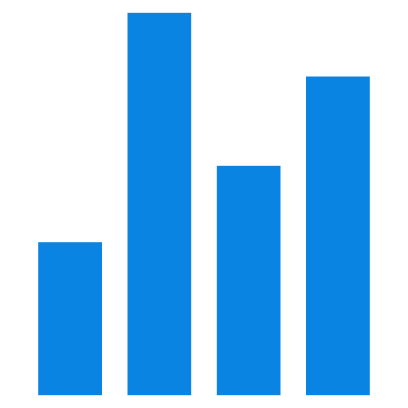

**Hi, I'm Przemek  a researcher and data scientist based in San Diego, CA. 
I use data to find answers, solve problems, and make things more interesting.**

#### Skills

 R  Python  SQL  Shiny  Data Science   Data Analysis  Machine Learning  Experimental Design

#### Explore my work

 <a href="https://www.linkedin.com/in/przemyslaw-marcowski/" target="_blank">[LinkedIn]</a>  <a href="https://scholar.google.com/citations?user=sB2hWn0AAAAJ&hl=en" target="_blank">[Google Scholar]</a>

#### Curious how to pronounce my name? [Find out here.](https://www.howtopronounce.com/przemek)

